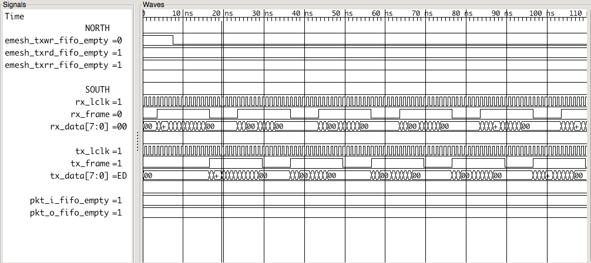

[](https://travis-ci.org/cfelton/parallella_elink)

# Parallella Epiphany Link (elink)
Work In Progress, check back later (01-May-2015) or delete.

Parallella *elink* design verification (DV) and alternate 
implementation.  The alternative implementation goal is to 
provide a flexible *elink* core that can easily be tailored 
for a specific usage.

The *elink* is the conduit between the FPGA and the 
[Adapteva Ephiphany processor](http://www.adapteva.com/epiphanyiii/).
This core in mainly used on the 
[parallella board](http://www.parallella.org/board/) but
the implementation is flexible enough to be used on any 
FPGA (or ASIC).


```
>> python test_elink_interfaces.py 
send packets
[ELINK] 00C0FFEEDECAFBADDEEDA5A50B
[ELINK] 0000000097C9AF60000002210B
  waiting ... txwr: 8, txrd: 0, txrr: 0, rxwr: 2, rxrd: 0, rxrr: 0
  waiting ... txwr: 7, txrd: 0, txrr: 0, rxwr: 2, rxrd: 0, rxrr: 0
[ELINK] 00000001DFDCC105000003EE0B
  waiting ... txwr: 7, txrd: 0, txrr: 0, rxwr: 3, rxrd: 0, rxrr: 0
  waiting ... txwr: 7, txrd: 0, txrr: 0, rxwr: 3, rxrd: 0, rxrr: 0
  waiting ... txwr: 6, txrd: 0, txrr: 0, rxwr: 3, rxrd: 0, rxrr: 0
[ELINK] 000000027F6DDEFE0000002C0B
  waiting ... txwr: 6, txrd: 0, txrr: 0, rxwr: 4, rxrd: 0, rxrr: 0
  waiting ... txwr: 5, txrd: 0, txrr: 0, rxwr: 4, rxrd: 0, rxrr: 0
[ELINK] 00000003F6B4D241000000550B
  waiting ... txwr: 5, txrd: 0, txrr: 0, rxwr: 5, rxrd: 0, rxrr: 0
  waiting ... txwr: 5, txrd: 0, txrr: 0, rxwr: 5, rxrd: 0, rxrr: 0
  waiting ... txwr: 4, txrd: 0, txrr: 0, rxwr: 5, rxrd: 0, rxrr: 0
[ELINK] 0000000408368D4B000003BA0B
  waiting ... txwr: 4, txrd: 0, txrr: 0, rxwr: 6, rxrd: 0, rxrr: 0
  waiting ... txwr: 3, txrd: 0, txrr: 0, rxwr: 6, rxrd: 0, rxrr: 0
[ELINK] 000000058E8A7B54000001310B
  waiting ... txwr: 3, txrd: 0, txrr: 0, rxwr: 7, rxrd: 0, rxrr: 0
  waiting ... txwr: 3, txrd: 0, txrr: 0, rxwr: 7, rxrd: 0, rxrr: 0
  waiting ... txwr: 2, txrd: 0, txrr: 0, rxwr: 7, rxrd: 0, rxrr: 0
[ELINK] 0000000619675074000003150B
  waiting ... txwr: 2, txrd: 0, txrr: 0, rxwr: 8, rxrd: 0, rxrr: 0
  waiting ... txwr: 1, txrd: 0, txrr: 0, rxwr: 8, rxrd: 0, rxrr: 0
[ELINK] 00000007EDDD69B7000000C90B
  waiting ... txwr: 1, txrd: 0, txrr: 0, rxwr: 9, rxrd: 0, rxrr: 0
  waiting ... txwr: 1, txrd: 0, txrr: 0, rxwr: 9, rxrd: 0, rxrr: 0
get packets looped back, 
[ELINK] 00000008DEE3B5CB0000019E0B
[ELINK] 0000000943B78AC3000000E90B
```



**Note**: this core will, more than likely, be moved to 
the [~~`mn`~~ `rhea` repository](http://www.github.com/cfelton/minnesota) in
the near future.
